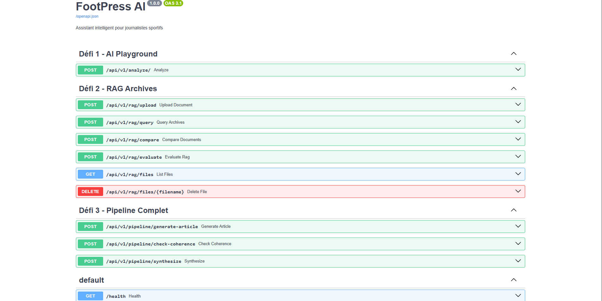
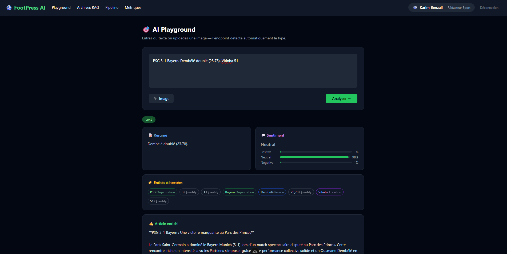
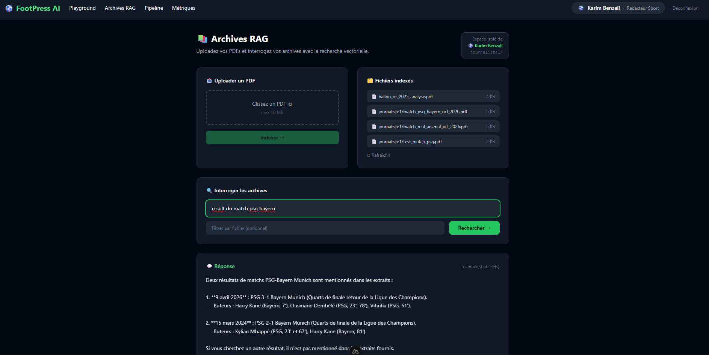
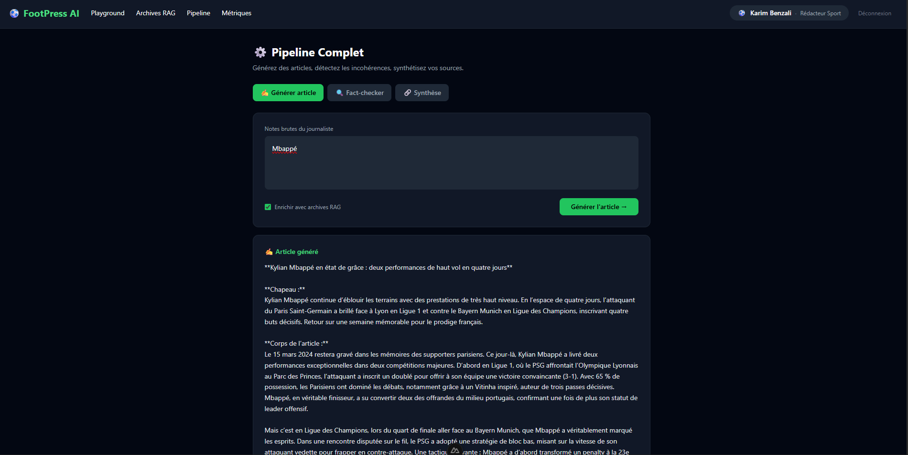
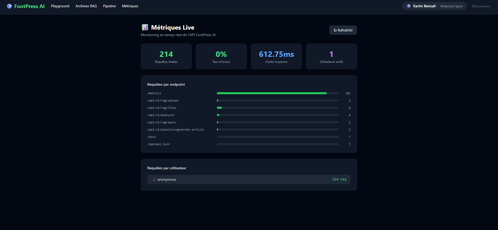
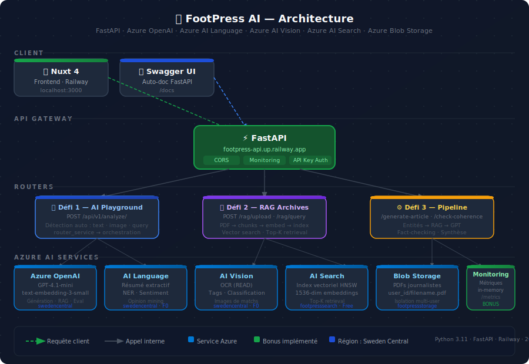

# ⚽ FootPress AI — Backend

> **Plateforme IA pour journalistes sportifs** — Analyse de texte, RAG sur archives PDF, génération d'articles et fact-checking, le tout alimenté par Azure AI.

[](https://python.org)
[](https://fastapi.tiangolo.com)
[](https://azure.microsoft.com)
[](https://railway.app)
[](LICENSE)

---

## 🚀 Demo Live

| Service | URL |
|---------|-----|
| **API (Railway)** | [https://footpress-api.up.railway.app](https://footpress-api.up.railway.app) |
| **Swagger UI** | [https://footpress-api.up.railway.app/docs](https://footpress-api.up.railway.app/docs) |
| **Frontend Nuxt 4** | [http://footpress.up.railway.app](http://footpress.up.railway.app/) |

---

## 📸 Captures d'écran

### Swagger UI — Vue d'ensemble des endpoints


### AI Playground — Analyse multi-type


### RAG — Indexation et requête vectorielle


### Pipeline — Génération d'article journalistique


### Métriques live


---

## 🧠 Contexte du projet

Les journalistes sportifs traitent chaque jour des dizaines de matchs, statistiques, interviews et documents. **FootPress AI** automatise trois tâches à forte valeur ajoutée :

1. **Analyser** — Résumé, sentiment, entités nommées, réponse contextuelle
2. **Archiver & retrouver** — Pipeline RAG sur PDFs (rapports de matchs, fiches joueurs)
3. **Produire** — Génération d'articles, fact-checking, synthèse multi-sources

---

## 🏗️ Architecture



### Pattern architectural : **Endpoint unique intelligent**

Au lieu de 15 endpoints spécialisés, un seul `POST /api/v1/analyze/` détecte automatiquement le type d'entrée et orchestre le pipeline adapté :

| Entrée détectée | Pipeline déclenché |
|-----------------|-------------------|
| Question football (`"Qui a gagné..."`) | GPT-4o direct |
| Texte journalistique | Language → résumé + entités + sentiment → GPT enrichissement |
| Image | Vision → OCR + tags → GPT analyse |

---

## 🛠️ Stack technique

| Couche | Technologie | Usage |
|--------|-------------|-------|
| **Framework** | FastAPI | API REST async, auto-documentation Swagger |
| **IA Générative** | Azure OpenAI GPT-4.1-mini | Génération, enrichissement, fact-checking |
| **Embeddings** | Azure OpenAI text-embedding-3-small | Vectorisation pour RAG |
| **NLP** | Azure AI Language | Résumé extractif, NER, analyse de sentiment |
| **Vision** | Azure AI Vision | OCR, classification d'images de matchs |
| **Recherche vectorielle** | Azure AI Search | Index HNSW, recherche sémantique sur archives |
| **Stockage** | Azure Blob Storage | PDFs uploadés par les journalistes |
| **Déploiement** | Railway | CI/CD depuis GitHub |
| **Config** | Pydantic Settings | Gestion des variables d'environnement |

---

## 📁 Structure du projet

```
footpressAI/
│
├── main.py                   # FastAPI app + CORS + middleware
├── config.py                 # Settings Pydantic (lecture .env)
│
├── routers/
│   ├── ai_router.py          # Défi 1 — POST /api/v1/analyze/
│   ├── rag_router.py         # Défi 2 — upload, query, evaluate
│   └── pipeline_router.py    # Défi 3 — generate-article, check-coherence, synthesize
│
├── services/
│   ├── router_service.py     # Détection type d'entrée + orchestration
│   ├── openai_service.py     # Wrapper Azure OpenAI (generate + embed)
│   ├── text_service.py       # Azure AI Language (résumé, entités, sentiment)
│   ├── vision_service.py     # Azure AI Vision (OCR + tags)
│   ├── rag_service.py        # Pipeline RAG complet (chunk → embed → index → query)
│   ├── blob_service.py       # Azure Blob Storage (upload, list, delete)
│   ├── pipeline_service.py   # Orchestration use-case (article, fact-check, synthèse)
│   └── rag_eval_service.py   # [Bonus] Évaluation qualité RAG (GPT self-eval)
│
├── middleware/
│   └── logging_middleware.py # Monitoring : logs + métriques en mémoire
│
├── security/
│   └── api_key.py            # Auth par clé API (multi-utilisateurs)
│
├── CRITIQUE.txt              # Défi 4 — Analyse critique honnête du projet
├── Procfile                  # Commande de démarrage Railway
├── runtime.txt               # Python 3.11
└── requirements.txt
```

---

## 🔌 Endpoints

### Défi 1 — AI Playground

```http
POST /api/v1/analyze/
Content-Type: multipart/form-data

text: "PSG 2-1 Bayern. Mbappé doublé. Possession PSG 54%."
```

**Réponse (type `text`) :**
```json
{
  "type": "text",
  "summary": { "summary": "Le PSG s'impose 2-1 face au Bayern..." },
  "sentiment": { "sentiment": "positive", "scores": { "positive": 0.87 } },
  "entities": { "entities": [{ "text": "PSG", "category": "Organization" }] },
  "enriched": "Dans une soirée mémorable au Parc des Princes..."
}
```

### Défi 2 — RAG Archives

```http
POST /api/v1/rag/upload          # Upload + indexation PDF
POST /api/v1/rag/query           # Recherche vectorielle
GET  /api/v1/rag/files           # Liste des documents
POST /api/v1/rag/evaluate        # [Bonus] Score qualité RAG
```

**Exemple query :**
```json
{
  "answer": "Dembélé a inscrit un doublé (23e et 78e minute)...",
  "sources_used": [{ "file": "match_psg_bayern.pdf", "chunk": 3 }],
  "nb_chunks_retrieved": 5
}
```

### Défi 3 — Pipeline

```http
POST /api/v1/pipeline/generate-article   # Notes → article structuré
POST /api/v1/pipeline/check-coherence    # Fact-checking article vs stats
POST /api/v1/pipeline/synthesize         # Synthèse multi-sources
```

### Bonus — Monitoring & Sécurité

```http
GET  /metrics       # Métriques temps réel
GET  /health        # Health check
GET  /info          # Justification des choix d'architecture
```

---

## ⚙️ Installation locale

### Prérequis
- Python 3.11+
- Compte Azure avec les services provisionnés

### 1. Cloner et installer

```bash
git clone https://github.com/shakiroye/footpressAI.git
cd footpressAI
python -m venv venv
source venv/bin/activate  # Windows: venv\Scripts\activate
pip install -r requirements.txt
```

### 2. Variables d'environnement

```bash
cp .env.example .env
# Remplir les clés Azure dans .env
```

### 3. Lancer

```bash
uvicorn main:app --reload --port 8000
```

Swagger disponible sur : **http://localhost:8000/docs**

---

## 🔐 Authentification multi-utilisateurs

Chaque journaliste dispose d'une clé API unique envoyée dans le header :

```http
X-API-Key: key-j1-footpress
```

Les fichiers uploadés dans le RAG sont automatiquement préfixés par l'identifiant utilisateur (`journaliste1/rapport.pdf`), garantissant une isolation des données.

---

## 📊 Métriques en temps réel

```json
{
  "total_requests": 142,
  "error_rate_pct": 1.4,
  "avg_duration_ms": 2340,
  "active_users": 3,
  "requests_by_endpoint": {
    "/api/v1/analyze/": 87,
    "/api/v1/rag/query": 34
  },
  "requests_by_user": {
    "journaliste1": 89,
    "journaliste2": 45
  }
}
```

---

## 🧪 Tester l'API

### Avec curl

```bash
# Health check
curl https://footpress-api.up.railway.app/health

# Analyse de texte
curl -X POST https://footpress-api.up.railway.app/api/v1/analyze/ \
  -H "X-API-Key: demo-key-footpress" \
  -F "text=PSG 2-1 Bayern. Mbappé doublé. Possession PSG 54%."

# Upload PDF
curl -X POST https://footpress-api.up.railway.app/api/v1/rag/upload \
  -H "X-API-Key: key-j1-footpress" \
  -F "file=@match_report.pdf"

# Requête RAG
curl -X POST https://footpress-api.up.railway.app/api/v1/rag/query \
  -H "X-API-Key: key-j1-footpress" \
  -F "question=Combien de buts a marqué Mbappé ?"
```

---

## 📝 Analyse critique (Défi 4)

Le fichier [`CRITIQUE.txt`](CRITIQUE.txt) contient une analyse honnête du projet :
- Ce qui fonctionne bien en production
- Les points fragiles et limitations connues
- L'analyse des coûts Azure
- Les améliorations prioritaires

---

## 📄 Licence

MIT — Projet académique ESTIAM 2025-2026
